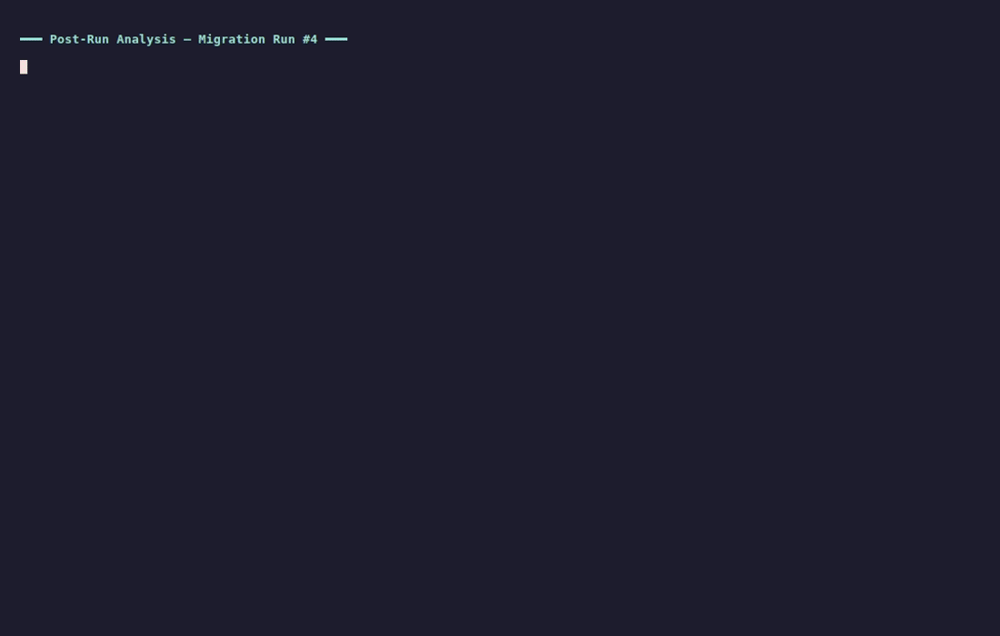

# Post-Run Analysis

Every run produces data. Most of it gets lost. This skill captures, compares, and learns from every iteration.

**Automatic post-mortem for Claude Code.** Parses logs from any runner, compares against history, spots recurring patterns, proposes fixes, and updates project memory. Builds, tests, migrations, deployments -- if it produces a log, this skill reads it.

## Install

```
/plugin marketplace add JuanMarchetto/agent-skills
/plugin install post-run-analysis@agent-skills
```

Or via [skills.sh](https://skills.sh):
```bash
npx skills add JuanMarchetto/post-run-analysis-skill
```

Or manually:
```bash
git clone https://github.com/JuanMarchetto/post-run-analysis-skill.git
cp -r post-run-analysis-skill ~/.claude/skills/post-run-analysis
```

## How It Works



A 5-phase protocol that runs automatically when any process completes:

```
Run completes --> Gather data --> Compare history --> Analyze errors --> Recommend --> Persist
                                      ^                                               |
                                      |                                               |
                                      +-----------------------------------------------+
```

1. **Gather** -- Find the log, extract metrics (duration, pass/fail, error counts, coverage)
2. **Compare** -- Load run history, build the comparison table, flag trends and anomalies
3. **Analyze** -- Categorize errors, identify recurring patterns, check if fixes regressed
4. **Recommend** -- Classify as FIXED / FIXABLE / NEEDS_INVESTIGATION / ACCEPTED
5. **Persist** -- Update run history, save actionable findings to memory, update artifacts

The skill triggers automatically on background task completion, test suite finish, and build/deploy end. No manual invocation needed -- though `/analyze` is there when you want it.

## Example Output

```
## Run #7 Analysis: test-suite

### Metrics
| Metric        | This Run | Previous Best | Delta  |
|---------------|----------|---------------|--------|
| Duration      | 42s      | 38s           | +4s    |
| Tests passed  | 147      | 145           | +2     |
| Tests failed  | 3        | 1             | +2     |
| Coverage      | 87.2%    | 86.5%         | +0.7%  |

### Error Breakdown
| Error Type            | Count | Recurring? | Status              |
|-----------------------|-------|------------|---------------------|
| Timeout in auth tests | 2     | Yes (3x)   | NEEDS_INVESTIGATION |
| Missing mock for API  | 1     | No         | FIXABLE             |

### Recommendations
1. [NEEDS_INVESTIGATION] Auth test timeouts appearing in 3 of last 5 runs
   -- Likely race condition in token refresh. Needs isolated reproduction.
2. [FIXABLE] Missing mock for /api/v2/users endpoint
   -- File: tests/mocks/api.ts, Change: Add users endpoint mock

### Memory Updates
- [x] Run history updated (#7)
- [x] Finding persisted: auth test timeout pattern
- [ ] Warm-start: no improvement over run #5

### Ready for Next Run?
No -- investigate auth timeout before next run to avoid masking other failures.
```

## Run History

Every analyzed run gets tracked in a standard table:

```
| # | Date       | Target     | Duration | Pass/Fail | Key Metric   | Delta |
|---|------------|------------|----------|-----------|--------------|-------|
| 7 | 2026-03-17 | test-suite | 42s      | PASS      | 87.2% cov    | +0.7% |
| 6 | 2026-03-16 | test-suite | 51s      | FAIL      | 86.5% cov    | -1.0% |
| 5 | 2026-03-15 | migration  | 3m12s    | PASS      | 847/900 files| +23   |
```

Use `/runs` to browse history and `/compare` to diff any two runs.

## What It Parses

Built-in patterns for:

| Tool | Metrics | Error detection |
|------|---------|-----------------|
| **Rust** (cargo) | Build time, warnings, errors, unsafe count | E-codes, borrow checker, lifetimes |
| **Jest / Vitest** | Pass/fail, coverage, snapshots, duration | Assertions, timeouts, mock errors |
| **pytest** | Pass/fail/skip, coverage, warnings | Assertions, fixtures, imports |
| **Go test** | Pass/fail, coverage, benchmarks | Panics, race conditions, vet errors |
| **Docker** | Build time, layers, cache hits, image size | Build failures, COPY errors, OOM |
| **npm / pnpm** | Install time, packages, audit, vulnerabilities | Resolve failures, peer deps, integrity |

For unfamiliar log formats, the skill falls back to general parsing: find the summary line, count errors, extract timing.

## Commands

| Command | What it does |
|---------|-------------|
| `/analyze` | Force analysis of the most recent run |
| `/runs` | Browse run history -- trends, best/worst, streaks |
| `/compare <run1> <run2>` | Side-by-side comparison of two runs |

## Confidence Gate

Not every finding deserves memory space. The skill applies a strict filter:

| Status | Persisted? | Why |
|--------|-----------|-----|
| **FIXABLE** | Yes | Actionable -- needs to be tracked until resolved |
| **NEEDS_INVESTIGATION** | Yes | Unknown root cause -- must not be forgotten |
| **FIXED** | No (report only) | Fix already exists, no action needed |
| **ACCEPTED** | No (report only) | Conscious trade-off, not worth tracking |

## Secret Sanitization

All data is sanitized before being written to any persistent file. API keys, tokens, passwords, connection strings, absolute paths, emails, and IPs are automatically redacted. Run history and memory files are safe to commit.

## Synergy with learn-by-mistake

These two skills are designed to work together:

- **post-run-analysis** identifies error patterns across runs and tracks metrics over time
- **learn-by-mistake** captures individual error lessons and applies them preventively

When post-run-analysis finds a recurring FIXABLE error, it suggests creating a lesson via `/learn`. When learn-by-mistake applies a lesson that fixes an error, the next post-run-analysis confirms the fix worked. Together they form a closed loop: detect, learn, prevent, verify.

## File Structure

```
post-run-analysis-skill/
  .claude-plugin/
    plugin.json           # Skill metadata
  commands/
    analyze.md            # /analyze -- force analysis
    runs.md               # /runs -- browse history
    compare.md            # /compare -- diff two runs
  references/
    log-patterns.md       # Detection patterns for common tools
  SKILL.md                # Core protocol (the brain)
  LICENSE
  README.md
```

At runtime, the skill reads logs from your project and writes to:

```
your-project/
  .claude/
    run-history.md        # Run tracking table
  MEMORY.md               # Findings and learnings (or equivalent)
```

## Requirements

- **Any AI coding assistant** that supports SKILL.md
- **No external dependencies** -- pure markdown, no installs, no build step
- Works with any tool that produces logs

## License

[MIT](LICENSE)
